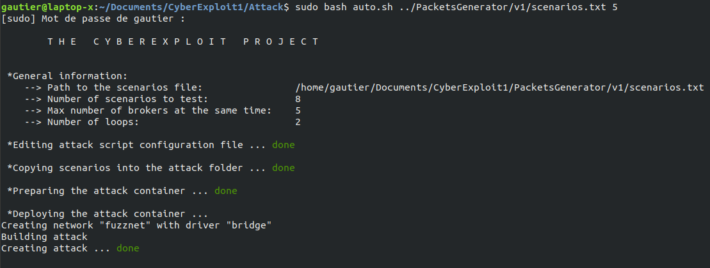
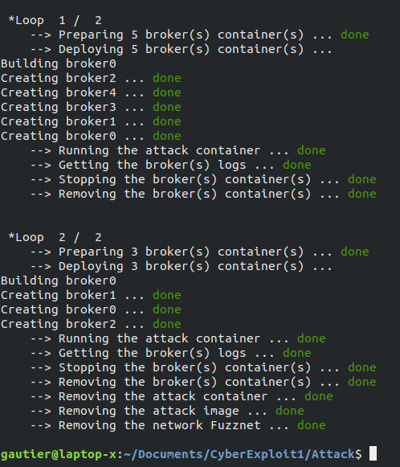

# The CyberExploit Project

### Project description
This project is an initiative of a group of **students** from the **Ecole Centrale d'Électronique (ECE Paris)** as part of our final year project. It proposes a set of tools to discover **vulnerabilities** within the **MQTT** communication protocol using the **fuzzing** technique.

Feel free to check our **paper** published on the **IEEE** website at the following address: https://ieeexplore.ieee.org/document/9148320

### Softwares description and Usage
This project proposes three tools that can be used **separately** or **complementary** :
- Scenario generator
- Scenario testing architecture
- Log analyzer

For our tests, we first generated scenarios that we tested with the architecture and then we used the log analysis tool to get results.

#### Scenario Generator
Some test scenarios could be generated with our script `PacketsGenerator/v1/scenarios_generator.py`. This file needs two arguments to work properly:
- The path to the output file (will be created if it doesn't exist)
- The number of scenarios to generate

##### Examples:

`python3 scenarios_generator.py <path to output file> <number of scenarios to generate>`

`python3 scenarios_generator.py ./scenarios.txt 8`

#### Test Architecture
The files needed to use the test architecture are located in the `Attack` folder.

The only script the user has to run is the `auto.sh` script. In order to work properly, it requires root rights and to specify several arguments in the following order:
1. path to scenarios file
2. max number of brokers to run simulatously

##### Examples:

`sudo bash auto.sh <path to file containing scenarios> <max number of broker to deploy simulatously>`

`sudo bash auto.sh ../PacketsGenerator/v1/scenarios.txt 5`

The script will then determine the number of scenarios to test, deploy the right number of brokers, load the scenario file into the attack container and deploy the attack container.

The logs for each file are retrieved and stored in the `Outputs' folder as they are created. Their name corresponds to the index of the tested scenario. For example, the logs corresponding to the 18th scenario will be stored in the `Attack/Outputs/18.log` file.

The more detailed logs of the auto.sh script are stored in the `Attack/Logs` folder and are named after the date the script was run.

#### Notes:
- The private ip range used for the containers is fixed.
- The maximum number of scenarios to be tested in one time is limited to 250 (so the maximum number of broker containers to deploy).
- There can be some crashes, especially when too many brokers are deployed simultaneously.

##### Log Analyzer
Log analysis is done via the `LogsAnalyser/Analyse.py` file. In order to work, it needs the path of the scenario file and the path of the directory where the logs are found.

##### Examples:

`python3 Analyse.py <path to file containing scenarios> <path to logs folder>`

`python3 Analyse.py ../PacketsGenerator/v1/scenarios.txt ../Attack/Outputs/`

The logs are analyzed with their corresponding scenarios one by one.
This analysis is done in two parts. First, it analyzes the scenarios via a score called `score_init` which is initialized to `0`. If we find gross errors in the scenario (for example if the first packet is not a `CONNECT` packet, or if we see an acknowledgment packet in the scenario) we add `1000` to `score_init`.

Then we analyze the logs. As in the first part, we initialize a score called `log_score`. If we find error messages in the logs we add `1000` to this score. Then we make the difference between the `score_init` and the `log_score`. Finally we add the duration of the scenario multiplied by 5 to get a final score:

Finally, the scenarios and their corresponding final scores are listed in a dataframe. This is converted into two files, `logs_scores.csv` and `logs_scores.xlsx`.

### Dependencies
- Test architecture :
   - `docker`
   - `docker-compose`
   - an Internet connection
- Scenario generator
  - `python3`
  - `scapy` (>= 2.4.3)
  - Our `mqtt.py` file instead of `/usr/local/lib/python3.6/site-packages/scapy/contrib/mqtt.py` OR instead of `/usr/local/lib/python3.6/dist-packages/scapy/contrib/mqtt.py` file
- Log analyzer
  - `python3`
  - `pandas` (>= 0.25.3)
  - `openpyxl`

### Copyright and license
All resources published by the Cyber Exploit Project are free: you can redistribute it or modify it under the terms of the GNU General Public License as published by the Free Software Foundation, either version 3 of the License, or any later version. See the GNU General Public License for more details.

### Authors
* **CASTEUR Gautier** - *Project Leader*
* **AUBARET Auriane**
* **PICAL Valetin**
* **BLONDEAU Benjamin**
* **QUEMAT Adrien**
* **CLOUET Valentin**
* **ZITOUNI Rafik** - *Mentor*
